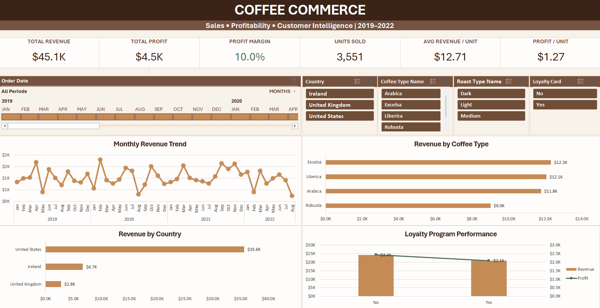

# ☕ Coffee Commerce — Interactive Sales & Profitability Analytics Dashboard

An interactive Microsoft Excel dashboard built to analyze coffee sales performance across **revenue, profitability, products, geography, customer loyalty, and time**.

The project transforms raw transactional data into a decision-focused dashboard with dynamic KPIs, PivotCharts, slicers, and a timeline—allowing users to explore business performance without manually filtering or analyzing the underlying dataset.



---

## 📌 Project Overview

Coffee Commerce contains transactional sales data covering multiple coffee products, roast types, countries, customers, and order dates from **2019–2022**.

The objective of this project was to build an interactive Excel analytics solution that enables stakeholders to quickly answer questions such as:

- How much revenue and profit has the business generated?
- How is revenue changing over time?
- Which coffee types generate the most revenue?
- Which geographic markets contribute the most sales?
- How does loyalty-program performance compare with non-loyalty sales?
- How do these metrics change when filtering by product, geography, loyalty status, or time?

---

## 🎯 Business Problem

Raw transactional data makes it difficult for decision-makers to quickly identify sales trends, profitable segments, geographic concentration, and product performance.

This dashboard provides a centralized analytical view of the business and allows users to dynamically investigate performance using:

- Order Date
- Country
- Coffee Type
- Roast Type
- Loyalty Card Status

All major dashboard components respond to the interactive filters.

---

## 📊 Key Performance Indicators

The unfiltered dashboard reports:

| KPI | Value |
|---|---:|
| Total Revenue | **$45.1K** |
| Total Profit | **$4.5K** |
| Profit Margin | **10.0%** |
| Units Sold | **3,551** |
| Average Revenue / Unit | **$12.71** |
| Profit / Unit | **$1.27** |

These KPIs dynamically update as users interact with the dashboard filters.

---

## 🔍 Dashboard Analysis

### 1. Monthly Revenue Trend

A monthly time-series analysis tracks revenue across 2019–2022, making it possible to identify fluctuations, stronger sales periods, and changes in performance over time.

### 2. Revenue by Coffee Type

Revenue contribution by coffee type:

| Coffee Type | Revenue |
|---|---:|
| Excelsa | **$12.3K** |
| Liberica | **$12.1K** |
| Arabica | **$11.8K** |
| Robusta | **$9.0K** |

Excelsa generates the highest overall revenue, although Liberica and Arabica perform relatively closely.

### 3. Revenue by Country

The United States is the dominant geographic market:

| Country | Revenue |
|---|---:|
| United States | **$35.6K** |
| Ireland | **$6.7K** |
| United Kingdom | **$2.8K** |

Approximately **79% of total revenue** comes from the United States, indicating significant geographic concentration.

### 4. Loyalty Program Performance

The dashboard compares revenue and profit generated by loyalty and non-loyalty transactions.

| Loyalty Status | Revenue | Profit |
|---|---:|---:|
| No | **$24.2K** | **$2.4K** |
| Yes | **$20.9K** | **$2.1K** |

Non-loyalty transactions currently contribute more total revenue and profit.

This should not automatically be interpreted as non-loyalty customers being more valuable individually, since total performance is also influenced by transaction volume.

---

## 💡 Key Business Insights

- **Geographic concentration is high:** the United States contributes approximately 79% of total revenue, creating both a strong core market and potential geographic concentration risk.
- **Product revenue is relatively diversified:** Excelsa leads at approximately $12.3K, but Liberica and Arabica follow closely.
- **Robusta underperforms the other coffee types** in total revenue at approximately $9.0K.
- The business operates at an overall **profit margin of approximately 10%**.
- **Non-loyalty transactions generate more aggregate revenue and profit** than loyalty transactions, suggesting an opportunity to investigate loyalty adoption, retention, purchase frequency, and customer-level value in greater depth.
- Monthly revenue fluctuates considerably, making time-based filtering useful for investigating seasonal or period-specific performance.

---

## 🛠️ Excel Skills Demonstrated

This project demonstrates practical use of:

- PivotTables
- PivotCharts
- Interactive Slicers
- Timeline filtering
- Report Connections
- `GETPIVOTDATA`
- Structured Excel Tables
- Calculated profitability metrics
- Dynamic KPI design
- Data aggregation
- Sorting and ranking
- Custom number formatting
- Dashboard layout and visual hierarchy
- Business-oriented data visualization

---

## ⚙️ Dashboard Architecture

The workbook separates the analytical workflow into multiple layers:

**Raw Data → Calculations → Pivot Engine → Interactive Dashboard**

The dashboard uses PivotTables as an analytical backend while PivotCharts visualize aggregated results.

Dedicated helper PivotTables support dashboard KPIs, while slicers and the Order Date timeline are connected across relevant PivotTables using Report Connections.

This allows KPIs and visualizations to respond simultaneously to user selections.

---

## 🎛️ Interactive Features

Users can dynamically analyze performance by:

**📅 Order Date**  
Explore different periods using the interactive timeline.

**🌍 Country**  
Compare performance across the United States, Ireland, and the United Kingdom.

**☕ Coffee Type**  
Filter between Arabica, Excelsa, Liberica, and Robusta.

**🔥 Roast Type**  
Analyze Dark, Light, and Medium roast categories.

**💳 Loyalty Status**  
Compare loyalty and non-loyalty performance.

---

## 🎨 Dashboard Design

A custom coffee-inspired visual system was created to maintain consistency throughout the dashboard:

- **Espresso Brown** — titles and structural hierarchy
- **Mocha Brown** — interactive controls
- **Caramel** — revenue visualization and active states
- **Muted Green** — profitability metrics
- **Cream** — dashboard canvas

The goal was to create an Excel dashboard that remains functional while presenting information in a clean, executive-style layout.

---

## 📁 Repository Contents

```text
coffee-commerce-excel-dashboard/
│
├── Coffee_Commerce_Excel_Dashboard.xlsx
├── dashboard-preview.png
└── README.md
```

### `Coffee_Commerce_Excel_Dashboard.xlsx`

The complete interactive Excel workbook containing the source data, analytical calculations, PivotTables, PivotCharts, KPI calculations, slicers, timeline, and final dashboard.

### `dashboard-preview.png`

Preview of the completed interactive dashboard.

---

## 🚀 How to Use the Dashboard

1. Download `Coffee_Commerce_Excel_Dashboard.xlsx`.
2. Open the workbook in Microsoft Excel.
3. Navigate to the **Dashboard** worksheet.
4. Use the timeline and slicers to filter the analysis.
5. Observe how KPIs and charts dynamically respond to the selected filters.
6. Clear the filters to return to the overall business view.

> Microsoft Excel desktop is recommended for the best experience with PivotCharts, slicers, and timeline functionality.

---

## 📈 Potential Future Enhancements

Future iterations could extend the analysis with:

- Customer segmentation
- Repeat-purchase analysis
- Customer lifetime value
- Loyalty-member vs non-member AOV
- Product-level profitability analysis
- Year-over-year growth metrics
- Regional expansion analysis
- Forecasting and trend modeling

---

## 👩‍💻 About This Project

This project was developed as part of my **Data Analytics portfolio** to demonstrate how Excel can be used not only for spreadsheet calculations, but as an end-to-end business intelligence and decision-support tool.

The focus was on converting transactional data into **clear KPIs, interactive analysis, meaningful visualizations, and actionable business insights**.
